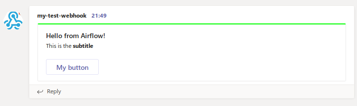

Airflow operator that can send messages to MS Teams

Example:

    op1 = MSTeamsWebhookOperator(task_id='msteamtest',
        http_conn_id='msteams_webhook_url',
        message = "Hello from Airflow!",
        subtitle = "This is the **subtitle**",
        button_text = "My button",
        button_url = "https://example.com",
        theme_color = "00FF00",
        #proxy = "https://yourproxy.domain:3128/",
        dag=dag)


Results in:

        


## Usage and Setup (Airflow, MS Teams)

For setup and usage instructions see [the writeup here](https://code.mendhak.com/Airflow-MS-Teams-Operator/)


## Testing this plugin locally for development

I've taken the docker compose yml from [here](https://airflow.apache.org/docs/apache-airflow/stable/howto/docker-compose/index.html), with a few changes. Load examples is false and added an extra_hosts.

Run this to prepare the environment:

```
mkdir -p ./dags ./logs ./plugins ./config
echo -e "AIRFLOW_UID=$(id -u)" > .env
docker compose up airflow-init
docker compose up
```

Then open http://localhost:8080 with airflow:airflow

To troubleshoot the requests going out, use the included httpecho container.  
In Airflow connections, create an HTTP Connection to http://httpecho:8081. 

```
docker compose logs -f httpecho
```


## Contribute

Any feature requests, please fork and submit a PR. 

### Wishlist

Ability to create potentialActions as seen here:

https://docs.microsoft.com/en-us/outlook/actionable-messages/actionable-messages-via-connectors

## License

Apache 2.0 (see code file headers) 